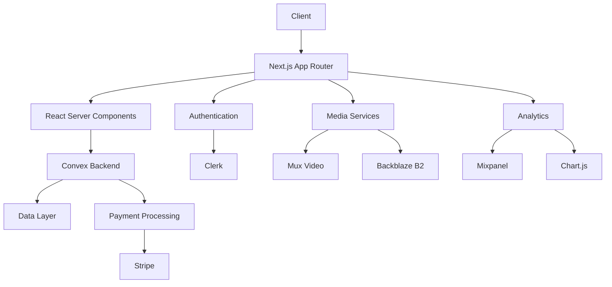

# Malik Arbab Portfolio Platform

<div align="center">

[](https://nextjs.org/)
[](https://www.typescriptlang.org/)
[](https://www.convex.dev/)
[](https://tailwindcss.com/)
[](LICENSE)

A modern, enterprise-grade portfolio and digital services platform leveraging cutting-edge web technologies for optimal performance, scalability, and user experience.

[Live Demo](https://malikarbab.de) · [Documentation](https://github.com/Absumere/malik-portfolio/wiki) · [Report Issue](https://github.com/Absumere/malik-portfolio/issues)

</div>

---

## 🌟 Enterprise Features

- **Real-time Data Sync**: Leveraging Convex's real-time capabilities for instant updates
- **Enterprise-grade Security**: Multi-layer security with Clerk authentication and RBAC
- **Scalable Infrastructure**: Cloud-native architecture with automated scaling
- **Analytics & Monitoring**: Comprehensive tracking with Mixpanel and Chart.js
- **Multi-payment Gateway**: Integrated Stripe payment processing
- **Advanced Media Processing**: Mux video platform and Backblaze B2 storage

## 🚀 Tech Stack

### Core Architecture
- **Next.js 15.1.4**: Server-side rendering and static site generation
  - App Router for enhanced routing capabilities
  - Server Components for optimal performance
  - Edge Runtime for API routes
  - Streaming SSR for improved TTFB
- **React 18.2.0**: UI library with concurrent features
  - Suspense for data fetching
  - Concurrent rendering
  - Server Components integration
- **TypeScript 5.3.3**: Enterprise-grade type safety
  - Strict type checking
  - Custom type definitions
  - Advanced type utilities

### Backend Infrastructure
- **Convex 1.8.0**: Real-time serverless database and backend
  - Optimistic updates
  - Real-time subscriptions
  - Automatic scaling
  - Custom functions and queries
  - Schema validation
  - Transaction support

### Authentication & Security
- **Clerk 6.9.9**: Enterprise authentication system
  - Multi-factor authentication
  - Social login providers
  - JWT token management
  - Session handling
  - User management dashboard

### Media Processing & Storage
- **Mux**: Enterprise video platform
  - Adaptive bitrate streaming
  - Real-time video analytics
  - Global CDN delivery
  - Video optimization
- **Backblaze B2**: Enterprise object storage
  - S3-compatible API
  - Cloudflare CDN integration
  - Infinite scalability
  - Automatic replication
  - Data lifecycle management

### Frontend Architecture
- **Tailwind CSS 3.4.1**: Utility-first styling system
  - Custom design system
  - Dark mode support
  - Responsive design
  - Performance optimization
- **HeadlessUI & Radix UI**: Accessible component libraries
  - ARIA compliance
  - Keyboard navigation
  - Screen reader support
- **GSAP & Framer Motion**: Animation systems
  - Hardware-accelerated animations
  - ScrollTrigger integration
  - Custom animation hooks
- **Tremor**: Analytics and dashboard components
  - Interactive charts
  - Data visualization
  - Real-time updates

### Development & DevOps
- **ESLint & Prettier**: Code quality tools
  - Custom rule configurations
  - Git hooks integration
  - Automatic formatting

## 🏗️ Architecture Overview



## 💻 Development

### Prerequisites
- Node.js 20.x
- npm 10.x
- Git 2.x

### Setup
```bash
# Clone repository
git clone https://github.com/yourusername/malik-portfolio.git

# Install dependencies
npm install

# Set up environment variables
cp .env.example .env.local

# Start development environment
npm run dev         # Next.js development server
npm run convex:dev  # Convex development server
```

### Environment Configuration
```env
# Core Configuration
NEXT_PUBLIC_CONVEX_URL=
CONVEX_DEPLOY_KEY=

# Authentication
NEXT_PUBLIC_CLERK_PUBLISHABLE_KEY=
CLERK_SECRET_KEY=

# Payment Processing
NEXT_PUBLIC_STRIPE_PUBLISHABLE_KEY=
STRIPE_SECRET_KEY=

# Media Services
MUX_TOKEN_ID=
MUX_TOKEN_SECRET=

# Storage
B2_APPLICATION_KEY_ID=
B2_APPLICATION_KEY=
B2_BUCKET_NAME=
B2_BUCKET_ID=
B2_ENDPOINT=
B2_CLOUDFLARE_URL=

# Analytics
NEXT_PUBLIC_MIXPANEL_TOKEN=
```

## 🚀 Deployment

### Production Deployment
```bash
# Build application
npm run build

# Deploy to Vercel
vercel deploy --prod

# Deploy Convex functions
npm run convex:deploy
```

### Infrastructure
- **Frontend**: Vercel Edge Network
- **Backend**: Convex Cloud
- **Media**: Mux & Backblaze B2
- **Database**: Convex Distributed Database
- **CDN**: Cloudflare & Vercel Edge

## 📈 Performance Metrics

- **Lighthouse Score**: 95+ across all metrics
- **Core Web Vitals**:
  - LCP: < 2.5s
  - FID: < 100ms
  - CLS: < 0.1
- **Time to First Byte**: < 200ms
- **Time to Interactive**: < 3.5s

## 🔒 Security Measures

- **Authentication**: Multi-factor authentication with Clerk
- **Authorization**: Role-based access control
- **Data Protection**: End-to-end encryption
- **API Security**: Rate limiting & JWT validation
- **Input Validation**: Server-side validation
- **XSS Protection**: Content Security Policy
- **CSRF Protection**: Token validation
- **Security Headers**: HSTS, X-Frame-Options

## 📝 License & Legal

Copyright 2024 Malik Arbab. All rights reserved.

This software is proprietary and confidential. Unauthorized copying, modification, distribution, or use of this software, via any medium, is strictly prohibited.
